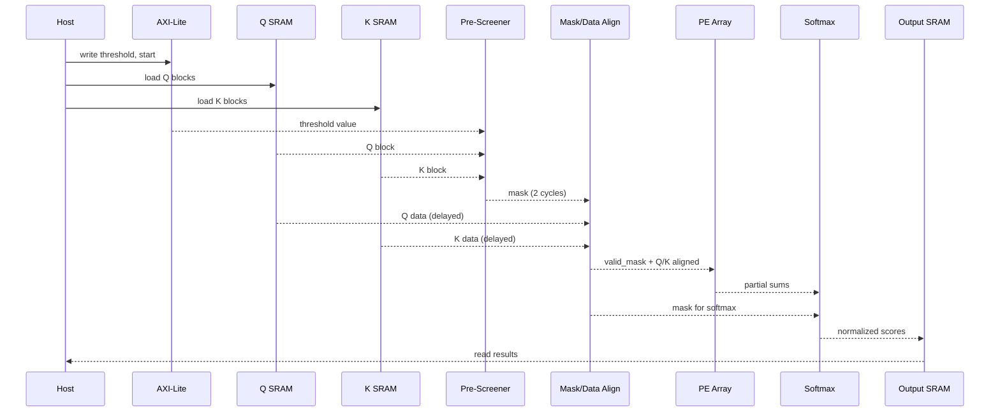

## DYNASPARSE Architecture (ASCII diagrams)

### End-to-end dataflow
```
        +---------------+        +-----------------+        +------------------+
Q/K SRAM|  Load Buffers |  Q,K   | Magnitude       | mask   | Sparse Systolic  |  partial
 blocks | (double buf)  |------->| Pre-Screener    |------->| PE Array         |--> scores
        +-------+-------+        +--------+--------+        +---------+--------+
                ^                         |                          |
                |                         v                          v
                |                  Threshold Reg                Masked Softmax
                |                (AXI-Lite write)               + Writeback SRAM
                |                         |                          |
                +-------------------------+--------------------------+
                                      Control FSM
```

### Pre-screener pipeline (per block)
```
cycle 0: capture Q_block, K_block
cycle 1: abs() on each element  -> partial sums level 1
cycle 2: adder tree reduces |Q|1 and |K|1 (pipelined)
cycle 3: multiply |Q|1 * |K|1 (or shift-add) -> compare to threshold -> valid flag
```

### Systolic array with gating (4x4 shown)
```
         K stream -->
   +------+------+------+------+      valid_in drives all PEs in a row/col
 Q | PE00 | PE01 | PE02 | PE03 |     when 0: accumulators hold, inputs bypass
 s |------+-----+------+------+ 
 t | PE10 | PE11 | PE12 | PE13 |
 r |------+-----+------+------+ 
 e | PE20 | PE21 | PE22 | PE23 |
 a |------+-----+------+------+
 m | PE30 | PE31 | PE32 | PE33 |
   +---------------------------+
          outputs -->
```

### Control FSM (simplified)
```
 IDLE -> LOAD_Q -> LOAD_K -> PRESCREEN -> COMPUTE -> WRITEBACK -> (next block or IDLE)
             |__________double-buffered to hide load latency____________|
```

### Mermaid block diagram (high level)
```mermaid
flowchart LR
    subgraph Buffers
        QBUF[Q Buffer]
        KBUF[K Buffer]
    end
    PS[Pre-screener<br/>|Q|1*|K|1 cmp]
    MASK[Mask FIFO<br/>(align latency)]
    ARRAY[Systolic PE Array<br/>valid gating]
    SOFTMAX[Masked Softmax<br/>log-sum-exp + LUT exp]
    AXI[AXI-Lite<br/>Control/Config]

    QBUF --> PS
    KBUF --> PS
    PS --> MASK
    MASK --> ARRAY
    QBUF --> ARRAY
    KBUF --> ARRAY
    ARRAY --> SOFTMAX --> OUT[SRAM / Host]
    AXI --> PS
    AXI --> QBUF
    AXI --> KBUF
    AXI --> SOFTMAX
    AXI --> OUT
```

### Mermaid sequence of datapath (detailed)


### Mermaid component decomposition
```mermaid
graph TD
    subgraph Prescreener
        ABS[Abs units]
        ADD[Adder tree (|Q|₁,|K|₁)]
        MUL[MUL (|Q|₁×|K|₁)]
        CMP[Comparator vs threshold]
        ABS --> ADD --> MUL --> CMP
    end

    subgraph PE_Array[PE Array DIMxDIM]
        PE00((PE))
        PE01((PE))
        PE02((PE))
        PE03((PE))
    end

    subgraph Softmax
        SHIFT[Max subtract]
        LUT[Exp LUT ROM]
        SUM[Adder tree]
        RECIP[Reciprocal]
        NORM[Multiply & normalize]
        SHIFT --> LUT --> SUM --> RECIP --> NORM
    end

    Buffers(Q/K SRAM) --> Prescreener
    Prescreener --> PE_Array
    Buffers --> PE_Array
    PE_Array --> Softmax --> OutSRAM(Output SRAM)
    AXI_CFG[AXI-Lite Config] --> Prescreener
    AXI_CFG --> Buffers
    AXI_CFG --> Softmax
    AXI_CFG --> OutSRAM
```

### Fixed-point considerations
- Q, K stored as signed fixed-point (e.g., total 16 bits, frac 8). The pre-screener uses absolute values and additions only.
- Threshold register uses same scaling. Document chosen format in `docs/fixed_point.md` before RTL coding.

### AXI-Lite register map (draft)
- `0x00`: control (start, reset, mode)
- `0x04`: status (busy, done)
- `0x08`: threshold (fixed-point)
- `0x0C`: block dims (rows, cols)
- `0x10`: Q write window base
- `0x14`: K write window base
- `0x18`: output read window base
Adjust once block sizes are finalized.
